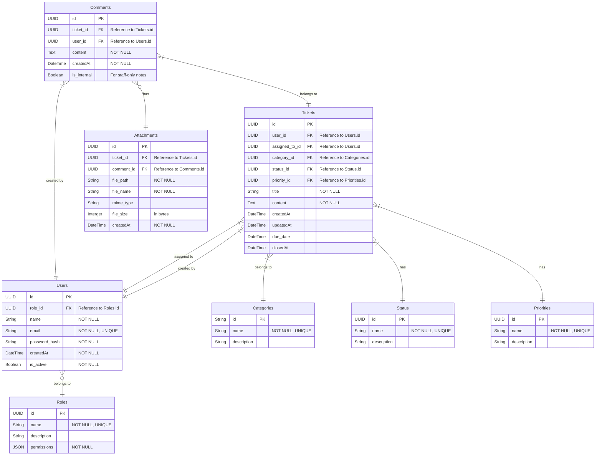

### Initial concept ER Diagram for MasterTicket

```mermaid 
erDiagram
    Users {
        UUID id PK
        UUID role_id FK "Reference to Roles.id"
        String name "NOT NULL"
        String email "NOT NULL, UNIQUE"
        String password_hash "NOT NULL"
        DateTime createdAt "NOT NULL"
        Boolean is_active "NOT NULL"
    }
    Roles {
        UUID id PK
        String name "NOT NULL, UNIQUE"
        String description
        JSON permissions "NOT NULL"
    }
    Categories {
        String id PK
        String name "NOT NULL, UNIQUE"
        String description
    }
    Tickets {
        UUID id PK
        UUID user_id FK "Reference to Users.id"
        UUID assigned_to_id FK "Reference to Users.id"
        UUID category_id FK "Reference to Categories.id"
        UUID status_id FK "Reference to Status.id"
        UUID priority_id FK "Reference to Priorities.id"
        String title "NOT NULL"
        Text content "NOT NULL"
        DateTime createdAt
        DateTime updatedAt
        DateTime due_date
        DateTime closedAt
    }
    Status {
        UUID id PK
        String name "NOT NULL, UNIQUE"
        String description
    }
    Priorities {
        UUID id PK
        String name "NOT NULL, UNIQUE"
        String description
    }
    Comments {
        UUID id PK
        UUID ticket_id FK "Reference to Tickets.id"
        UUID user_id FK "Reference to Users.id"
        Text content "NOT NULL"
        DateTime createdAt "NOT NULL"
        Boolean is_internal "For staff-only notes"
    }
    Attachments {
        UUID id PK
        UUID ticket_id FK "Reference to Tickets.id"
        UUID comment_id FK "Reference to Comments.id"
        String file_path "NOT NULL"
        String file_name "NOT NULL"
        String mime_type 
        Interger file_size "in bytes"
        DateTime createdAt "NOT NULL"
    }
    Users }o--|| Roles : "belongs to"
    Tickets }|--|| Users : "created by"
    Tickets }|--|| Users : "assigned to"
    Tickets }|--|| Categories : "belongs to"
    Tickets }|--|| Status : "has"
    Tickets }|--|| Priorities : "has"
    Comments }|--|| Tickets : "belongs to"
    Comments }|--|| Users : "created by"
    Comments }o--|| Attachments : "has"


```
### ER Diagram for MasterTicket

